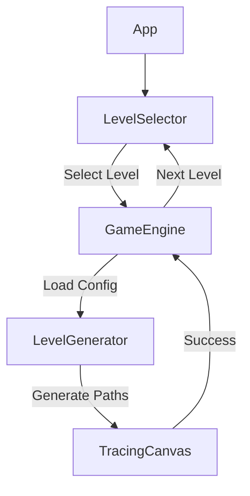

# Design: Level Generator & System Architecture

## Core Concepts

### 1. Difficulty Scaling
The core of this system is the progressive difficulty, controlled by:
*   **Curvature**: How "bendy" the paths are.
*   **Intersects**: How often paths cross.
*   **Tolerance**: Hit area size (Easy: large, Hard: strict).

### 2. Procedural Path Generation
Instead of hardcoding SVG paths, we will use a `generatePath(start, end, difficulty)` function.
*   **Control Points**: Randomly generated between start and end nodes, with `variance` determined by difficulty.
*   **Easy**: 1 Control Point (Quadratic) or 2 simple ones (Cubic). Direct path.
*   **Medium**: 2-3 Control Points, wider variance, potential for S-curves.
*   **Hard**: 4+ Control Points, extreme variance to force loops or "knots" (self-intersections or cross-path intersections).

### 3. Level Data Structure
`LevelData.ts` will not store huge SVG strings. It will store the *metadata* to generate them, or we can pre-generate them once. The prompt implies a "Generator / Config System".

```typescript
export interface LevelConfig {
  id: number; // 1-30
  tier: 'easy' | 'medium' | 'hard';
  gridSize: number; // e.g., 3 pairs for easy, 4 for hard
  tolerance: number; // e.g., 40 for easy, 20 for hard
}
```

We will need a `GameEngine` or specific `LevelLoader` that takes this config and produces the `PathDef[]` expected by `TracingCanvas`.

## Component Architecture



### UI Flow
1.  **LevelSelector**: Tabs for Easy/Medium/Hard. Grid validation (lock/unlock logic can be simple strict progression for now: Level N requires Level N-1).
2.  **GameEngine (Wrapper)**:
    *   Manages current Level ID.
    *   Calls `LevelGenerator` to get paths.
    *   Passes paths and tolerance to `TracingCanvas` (renamed from `TangledCanvas` or uses it).
    *   Handles "Level Complete" -> unlocks next, shows modal.

## Algorithms via `generateBezierPath`
*   Input: `startPoint`, `endPoint`, `difficulty`
*   Logic:
    *   Calculate midpoint.
    *   Add random vector orthogonal to direction vector.
    *   Magnitude of random vector scales with difficulty.
    *   For "Hard", maybe add intermediate points to create loops.
